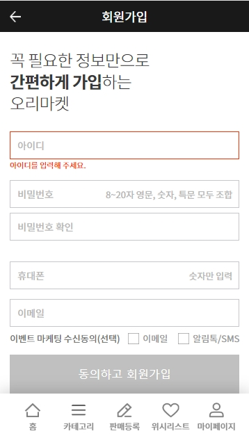
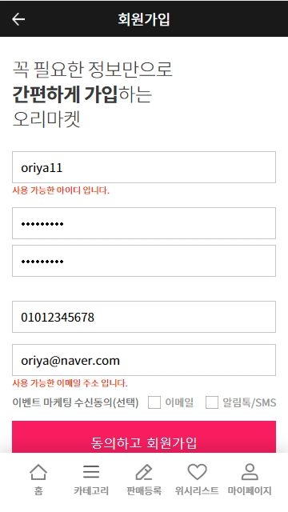

    개발팀 블로그도 만들어졌고 퍼블리셔에서 vue로 개발하게 되면서 경험담을 적어보는게 어떠냐고 하셔서 작성하게 되었습니다.  
    작업하면서 힘들었던 점 위주로 포스팅 할 예정입니다.

    기존 아이템베이 사이트 2.0에 투입해서 작업을 하다가 처음으로 팀이 바뀌고 새로운 프로젝트를 진행하면서 Vue를 접하게 됐습니다.
    React나 Angular가 아닌 Vue가 프로젝트에 사용된 이유는 러닝 커브가 낮고 성능 면에서도 다른 언어들에 비해 좋기 때문이라고 팀장님이 말씀하셔서 
    아 그렇구나 하고 배우게 됐는데요
    퍼블리셔였던 저한테는 러닝커브가 낮은거 같지 않다는 생각을 계속 하면서 R&D를 시작했습니다.

    처음엔 강의도 듣고 책도 사서 공부했는데 그때 아이템베이 오픈 API를 활용해 Vue로 등록기 샘플을 만들었습니다.
    SPA(single page aplication)의 장점을 살려 한 화면에 등록을 하면 바로 자신이 등록한 게시물을 볼수 있는 페이지였는데
    사실 디자인도 제맘대로 코딩도 제맘대로 한거라 부끄러웠지만 나름 처음 vue로 만든 페이지라 뿌듯했습니다.

참고 => <a href="https://openapi.itembay.com/resources/index.html" target="_balnk" style="color:#9c05dc">https://openapi.itembay.com/resources/index.html</a>

    하지만 프로젝트를 본격적으로 들어가 기획서도 나오고 디자인도 나오면서 등록기 샘플로 얻은 자신감은 내동댕이 쳐졌습니다.

    처음 회원쪽 작업을 먼저 하게 됐는데 validation check를 할때 VeeValidate를 사용해서 해보려고 했는데 처음 사용하다 보니 커스텀이 너무 어렵게 느껴져서
    애먹었던 기억이 있습니다.

영어로 되어있는 에러메세지를 한글로 변환시켜줘야 했는데 위 코드에서 처음엔 Vue.use(VeeValidate, dict)만 있으면 된다고 생각해서 작업을 했는데 
한글로 변환이 안돼서 찾아보니 Validator.localize('ko', dict)를 설정해 주어야 변환이 되었습니다. 간단하다면 간단한 거였는데 저 코드를 넣지 않고 한글 변환이 안된다고 한참을 삽질을 해서 매우 짜증났었네요 

작업을 하다보니 기존에 있는 VeeValidate 에러메세지가 충분히 잘 되어 있다고 느꼈는데 그래도 오리마켓에 맞는 에러메세지가 필요 했습니다. 때문에 에러메세지를 커스텀하는 작업이 필요했고 .extend를 활용하여 기존의 메세지가 아닌 원하는 유효성 검사를 할 수 있었습니다.

    
    위에 왼쪽 이미지처럼 인풋창에 포커스아웃시 유효성검사 체크가 되며 에러메세지가 뜨고 인풋에 모든 유효성 검사가 만족되면 오른쪽 이미지처럼 버튼이 활성화 되도록 UI를 구현하였습니다.

    버튼 활성화는 Vue에 computed라는 속성을 사용하여 작업을 했는데 메소드와 같은 함수를 정의할 수 있습니다. computed속성은 캐싱이 가능해 해당 데이터가 변경 될 때만 함수를 실행 해 버튼이 비활성화 되어 있다가 에러가 없는 경우에 true를 반환해 버튼에 on이라는 클래스가 추가 되어 버튼 활성화를 시켰습니다.    

    또 비활성화된 버튼을 .preven를 사용하여 에러메세지가 있을 경우 자동 실행이 되지 않도록 막아줍니다.

